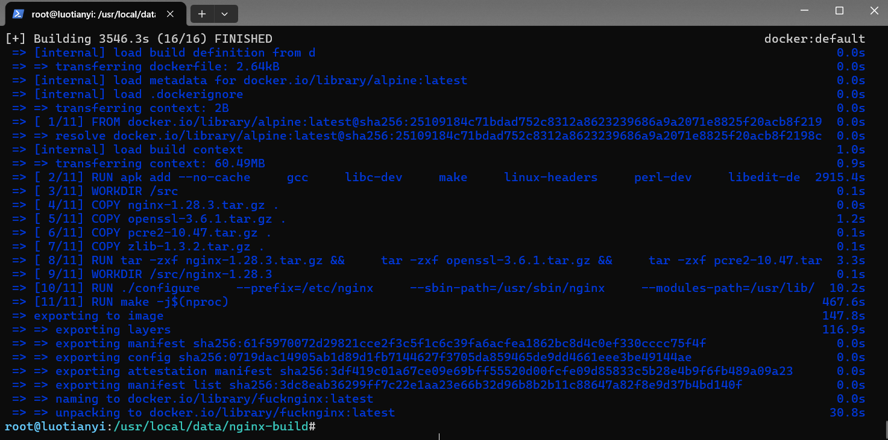

# Custom NGINX Docker Image 

这是一份专为追求极简与高可控性定制的 [NGINX](https://nginx.org) [(v1.28.3)](https://nginx.org/en/CHANGES-1.28) [Docker](https://www.docker.com/) 镜像使用指南。该镜像基于 [Alpine Linux](https://alpinelinux.org/?lang=zh-cn) 从源码编译，剥离了所有冗余组件，原生支持 [HTTP/3](https://zh.wikipedia.org/wiki/HTTP/3) [(QUIC)](https://zh.wikipedia.org/wiki/QUIC) 并对目录结构进行了深度的模块化重构。

---

## 📂 目录结构与文件位置

为保障生产环境的安全与可维护性，容器内部的路径被严格划分为三个核心区域。

### 1. 容器内部路径 (Container Paths)

* **`/nginx/` (核心运行时程序)**
    * `/nginx/nginx`：NGINX 核心可执行文件。
    * `/nginx/modules/`：动态加载模块目录。
    * `/nginx/run/`：存放 `nginx.pid` 和 `nginx.lock` 等进程状态文件（无需挂载）。
    * `/nginx/temp/`：存放运行时的所有临时文件（如 `client_body`, `proxy`, `fastcgi` 等，无需挂载）。
* **`/config/` (静态只读配置)**
    * `/config/nginx.conf`（及 `.default` 备份）：主配置文件骨架（已精简，仅做全局调度）。
    * `/config/mime.types`（及 `.default` 备份）：MIME 类型映射表，告诉浏览器如何识别文件格式。
    * `/config/fastcgi.conf` / `fastcgi_params`（及 `.default` 备份）：FastCGI 协议传参配置，用于连接 PHP-FPM 等动态后端。
    * `/config/uwsgi_params`（及 `.default` 备份）：uWSGI 协议传参配置，用于连接 Python (如 Django/Flask) 等 Web 应用。
    * `/config/scgi_params`（及 `.default` 备份）：SCGI 协议传参配置（保留以确保底层环境完整性）。
    * *注意：这部分配置已在构建镜像时固化，作为基础环境的底层支撑。日常维护不需要、也不建议修改。*
* **`/data/` (动态业务数据 - 需挂载至宿主机)**
    * `/data/configs/`：存放全局配置片段（如 `gzip.conf`, `ssl_params.conf`）。
    * `/data/sites/`：存放具体的站点虚拟主机配置（如 `my_website.conf`）。
    * `/data/logs/`：存放 `access.log` 和 `error.log`。

### 2. 宿主机映射路径 (Host Paths)
在宿主机运行容器的当前根目录下，存在以下结构（见`data`文件夹），运行容器时需进行精准映射：
```tree
./data
├── configs/   -> 挂载到容器的 /data/configs/
├── logs/      -> 挂载到容器的 /data/logs/
└── sites/     -> 挂载到容器的 /data/sites/
```
---

## 🚀 部署方案指南

本镜像支持“直接拉取使用”与“自行编译构建”两种方式。无论采用哪种方式，请确保你已经在设备上安装[Docker](https://www.docker.com/).

### 方案 A：直接拉取 NGINX Docker 镜像
#### 0.下载镜像
如果你已经安装 [git](https://git-scm.com/)，那么可以直接克隆本仓库到本地：
```bash
git clone https://github.com/lclty/nginx-image && cd ./nginx-image
```
如果你还没有安装 [git](https://git-scm.com/)，那么你可以点击右上角绿色的 `<> Code`，然后点击 `Download ZIP`，并在本地使用压缩工具解压缩压缩包。
#### 1.导入镜像
将镜像包载入 Docker：
```bash
docker load -i nginx.tar
```
#### 2.构建配置文件
切换到你储存 NGINX 配置文件的目录：
```bash
# 这里以 /usr/local/config/nginx 为例
# 若不存在储存 NGINX 配置文件的目录，需先执行 mkdir 命令创建该目录:
mkdir -p /usr/local/config/nginx
# 请将示例路径切换到你的实际路径，例如 /etc/nginx
cd /usr/local/config/nginx
```

在你储存 NGINX 配置文件的目录执行如下命令： 
```bash
mkdir -p ./configs ./logs ./sites
```

#### 3.启动容器
在第二步中储存 NGINX 配置文件的目录执行以下命令，完成目录挂载并开启 HTTP/3 所需的 UDP 端口：
```bash
docker run -d \
 
 --name nginx \
 
 --restart unless-stopped \
  -p 80:80 \
  -p 443:443 \
  -p 443:443/udp \
  -v $(pwd):/data \
  -v /var/www:/var/www \
  nginx:latest
```
### 方案 B：自行构建全新 NGINX Docker 镜像
适用于需要修改编译参数或更新底层组件版本的开发者。

#### 1. 编辑 Dockerfile 确定编译参数
进入构建目录并编辑 `Dockerfile` 以自定义编译参数。
```bash
cd ./nginx-build
# 用你熟悉的文本编辑器打开./Dockerfile
nano ./Dockerfile
```

#### 2.编译可执行文件
生成包含全量文件的编译镜像。该过程将根据设备配置与网络环境来决定所需时间长短。请尽可能使用较高的设备配置，并处于良好的国际网络连接环境中：
```bash
docker build -t nginx-build -f Dockerfile .
```
(P.S. 作者本人编译了3546.3秒)


#### 3. 提取核心文件
利用生成的编译镜像，将核心的可执行文件和配置文件提取至宿主机，提取后及时删除编译镜像：
```bash
docker create --name buildnginx nginx-build:latest
mkdir -p ./nginx-bin/nginx ./nginx-bin/config
docker cp buildnginx:/nginx/. ./nginx-bin/nginx/
docker cp buildnginx:/config/. ./nginx-bin/config/
docker rm buildnginx
```

#### 4. 构建运行镜像
进入二进制执行环境的目录，将提取出的极简环境打包为最终镜像：
```bash
cd ./nginx-bin
docker build -t custom-nginx:latest -f Dockerfile .
```

构建完成后，参考[方案 A](#2构建配置文件)的步骤 2 和步骤 3 启动容器即可。

---

## ⚙️ 日常配置维护

由于实现了配置的模块化分离，日常维护 **不需要** 进入容器，也 **不需要** 修改 `nginx.conf`。

1.  **新增虚拟主机**：在宿主机的储存 NGINX 配置文件的目录的 `./sites/` 目录下新建一个文本文件（例如 `example.com`），写入标准的 `server { ... }` 块，随后热重载容器，主配置会自动 `include` 并加载它。请注意，`rootdir` 必须使用容器内的绝对路径，且该目录已经挂载到容器中。
2.  **添加全局参数**：在宿主机的储存 NGINX 配置文件的目录的 `./configs/` 目录下新建一个文本文件（例如 `security`），随后热重载容器，这些配置会被主配置在 `http { ... }` 层级全局加载。
3.  **平滑重载配置**：宿主机修改配置文件后，直接通知容器热重载，无需重启服务：
    ```bash
    docker exec my-nginx /nginx/nginx -s reload
    ```

---

## 🔗 PHP Tips

如果你计划将此镜像与 Docker 化的 PHP-FPM 结合使用，请务必注意以下几点：

### 1. PHP-FPM 通信协议选择
* **TCP**：将 NGINX 和 PHP 容器放入同一个 Docker Network，直接通过容器名和 9000 端口通信，彻底规避文件权限问题。
    ```nginx
    # 在 site 配置文件中直接通过容器名与 9000 端口通信
    fastcgi_pass php_container_name:9000;
    ```
* **Unix Socket (`php-fpm.sock`)**：如果你坚持使用 Socket 文件通信，必须将宿主机的 Socket 目录同时挂载给 NGINX 和 PHP 容器。
    * 本镜像中 NGINX 是以 `nginx` 用户运行的。如果挂载进来的 `.sock` 文件所属用户是 `www-data` 或 `root`，NGINX 将无法读取，直接报错 502。请在运行前确保 PHP-FPM 的 `listen.mode` 设置为 `0666`，或者统一两个容器内执行用户的 UID/GID。

### 2. `rootdir` 同时挂载需求
无论是 NGINX (处理静态资源) 还是 PHP (解释动态脚本)，它们都需要读取**完全相同**的`rootdir`。
* 你必须将宿主机的网站`rootdir`（如 `/var/www/html`），**同时**挂载给 NGINX 容器和 PHP 容器。
* 两个容器内的绝对路径必须**严格一致**。如果不一致，NGINX 传递给 PHP 的 `SCRIPT_FILENAME` 变量就会指向一个不存在的路径，导致 PHP 报错 `File not found.`。

## NGINX Image 编译参数
```bash
nginx version: nginx/1.28.3 (build_by_lclty_March2026ver)
built by gcc 15.2.0 (Alpine 15.2.0)
built with OpenSSL 3.6.1 27 Jan 2026
TLS SNI support enabled
configure arguments: 
 --prefix=/nginx 
 --sbin-path=/nginx/nginx 
 --modules-path=/nginx/modules 
 --conf-path=/config/nginx.conf
 --error-log-path=/data/logs/error.log
 --http-log-path=/data/logs/access.log
 --pid-path=/nginx/run/nginx.pid
 --lock-path=/nginx/run/nginx.lock
 --http-client-body-temp-path=/nginx/temp/client_body
 --http-proxy-temp-path=/nginx/temp/proxy
 --http-fastcgi-temp-path=/nginx/temp/fastcgi
 --http-uwsgi-temp-path=/nginx/temp/uwsgi
 --http-scgi-temp-path=/nginx/temp/scgi
 --user=nginx
 --group=nginx
 --build=build_by_lclty_March2026ver
 --with-select_module
 --with-poll_module
 --with-threads
 --with-file-aio
 --with-http_ssl_module
 --with-http_v2_module
 --with-http_v3_module
 --with-http_realip_module
 --with-http_addition_module
 --with-http_xslt_module
 --with-http_image_filter_module
 --with-http_geoip_module
 --with-http_sub_module
 --with-http_dav_module
 --with-http_flv_module
 --with-http_mp4_module
 --with-http_gunzip_module
 --with-http_gzip_static_module
 --with-http_auth_request_module
 --with-http_random_index_module
 --with-http_secure_link_module
 --with-http_degradation_module
 --with-http_slice_module
 --with-http_stub_status_module
 --with-http_perl_module
 --with-mail
 --with-mail_ssl_module
 --with-stream
 --with-stream_ssl_module
 --with-stream_realip_module
 --with-stream_geoip_module
 --with-stream_ssl_preread_module
 --with-compat
 --with-pcre-jit
 --with-pcre=/source/pcre2-10.47
 --with-zlib=/source/zlib-1.3.2
 --with-openssl=/source/openssl-3.6.1
 --with-openssl-opt=no-shared
 --with-cc-opt='-O3 -flto'
 --with-ld-opt=-Wl,-z,relro,-z,now
 --with-perl_modules_path=/nginx/perl_lib
```
## 贡献

欢迎提交 [Issue](https://github.com/lclty/nginx-image/issues) 或 [Pull Request](https://github.com/lclty/nginx-image/pulls) 来改进这个镜像。

## 许可证

本镜像基于 [MIT](LICENSE) 协议开源。